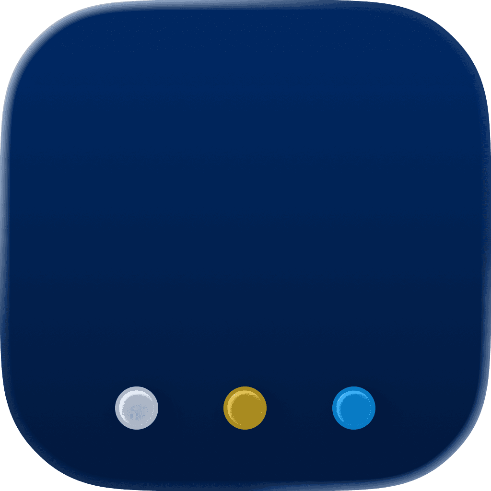

<p align="center">
    
</p>

<p align="center">
    
    
    <a href="https://danielsaidi.github.io/PageView"></a>
    <a href="https://github.com/danielsaidi/PageView/blob/master/LICENSE"></a>
</p>


# PageView

PageView is a custom SwiftUI page view that works on all major Apple platforms.

<p align="center">
    
</p>

`PageView` is a custom SwiftUI page view that works on all major Apple platforms. It mimics a paged TabView and can be set up with a list of pages, a list of items, or a `PageViewState` value.


## Installation

PageView can be installed with the Swift Package Manager:

```
https://github.com/danielsaidi/PageView.git
```


## Getting started

You can create a ``PageView`` with a collection of page views, an array of page items, or a ``PageViewState``.

```swift
struct MyView: View {

    @State var state = PageViewState(pages: Array(0...5))

        var body: some View {
        PageView(state) { page in
            VStack(spacing: 20) {
                Text("Page \(page)")
                Button(buttonTitle, action: nextPageOrRestart)
                    .padding(50)
                    .buttonStyle(.borderedProminent)
            }
        }
        .pageViewAnimation(.bouncy)
        .pageViewIndicatorDisplayMode(.automatic)
        .pageViewIndicatorStyle(.init(
            dotColor: .blue,
            currentDotColor: .yellow
        ))
        .background(
            color(for: state.pageIndex)
                .ignoresSafeArea()
                .animation(.easeOut, value: state.pageIndex)
        )
    }

    func color(for index: Int) -> Color {
        switch index {
        case 0: .red
        case 1: .green
        case 2: .blue
        case 3: .orange
        case 4: .pink
        case 5: .mint
        default: .purple
        }
    }

    func nextPageOrRestart() {
        if state.isLastPage {
            state.pageIndex = 0
        } else {
            state.showNextPage()
        }
    }
}
```

You can customize the page view animation with the ``pageViewAnimation(_:)`` view modifier, the page indicator display mode with ``pageViewIndicatorDisplayMode(_:)`` and its style with ``pageViewIndicatorStyle(_:)``.


## Documentation

The online [documentation][Documentation] has more information, articles, code examples, etc.


## Demo Application

The `Demo` folder has an app that lets you test the library.


## Support My Work

You can [become a sponsor][Sponsors] to help me dedicate more time on my various [open-source tools][OpenSource]. Every contribution, no matter the size, makes a real difference in keeping these tools free and actively developed.


## Contact

Feel free to reach out if you have questions or if you want to contribute in any way:

* Website: [danielsaidi.com][Website]
* E-mail: [daniel.saidi@gmail.com][Email]
* Bluesky: [@danielsaidi@bsky.social][Bluesky]
* Mastodon: [@danielsaidi@mastodon.social][Mastodon]


## License

PageView is available under the MIT license. See the [LICENSE][License] file for more info.


[Email]: mailto:daniel.saidi@gmail.com
[Website]: https://www.danielsaidi.com
[GitHub]: https://www.github.com/danielsaidi
[OpenSource]: https://danielsaidi.com/opensource
[Sponsors]: https://github.com/sponsors/danielsaidi

[Bluesky]: https://bsky.app/profile/danielsaidi.bsky.social
[Mastodon]: https://mastodon.social/@danielsaidi
[Twitter]: https://twitter.com/danielsaidi

[Documentation]: https://danielsaidi.github.io/PageView
[Getting-Started]: https://danielsaidi.github.io/PageView/documentation/pageview/getting-started
[License]: https://github.com/danielsaidi/PageView/blob/master/LICENSE
